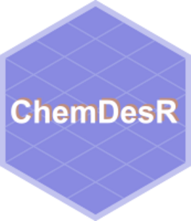

# chemdesr 

# {chemdesr} 📦

Functions used to scrape chemical information from the [ChemDes platform](http://www.scbdd.com/chemdes/), more specifically to assist with running the model found at https://dan-wacl.shinyapps.io/rie_shiny_app/.

To install, type the below code into your R console:

```
devtools::install_github('jack-davison/chemdesr')
```

## Features
There are two key functions in `chemdesr`:
* `read_chemdes`: Provided a simplified molecular-input line-entry system ("SMILES") string and a specific descriptor (e.g. Chemopy, CDK, etc.), scrapes the ChemDes platform and returns a *wide* data frame of the relevant chemical information. 
* `read_full_chemdes`: A wrapper around `read_chemdes` which automatically reads in Chemopy, CDK, RDKit, Pybel, and PaDEL data for a given *SMILES* string. There is an option to make this function "chatty" if you would like it to update you on its progress.
* `map_chemdes`: A wrapper around `read_full_chemdes` to make it easier to iterate over multiple compounds.

There are also example data:
* `chem_smiles`: A 42x2 dataframe containing 42 example compounds and their SMILES strings. Use this to practice with the `chemdesr` functions.

## Example Workflows
It is very simple to scrape a single compound using `chemdesr`. Your workflow may look something like this:

```
single_smiles = "OC(C)(C(CC(O)=O)CC(O)=O)C"

# Read a single descriptor (in this case Chemopy)
chemdesr::read_chemdes(single_smiles, desc = "chemopy")

# Read multiple descriptors
chemdesr::read_full_chemdes(single_smiles, chatty = T)
```

For multiple compounds, I'd suggest using a `map` function from `purrr`. For many compounds, I would recommend enabling the "chatty" option to be kept abreast of the function's progress. If you aren't confident with `purrr`, there is an in-built `map_chemdes` function to do this for you.

```
my_smiles = c("OC(C)(C(CC(O)=O)CC(O)=O)C", 
              "C(C=CC1)=CC=1C(=O)O", 
              "CC1(C)OC(=O)CC1CC(O)=O")

# Do it yourself
purrr::map_dfr(.x = my_smiles, .f = chemdesr::read_full_chemdes, chatty = T)

# Built-in mapping (equivalent to the above)
chemdesr::map_chemdes(my_smiles, chatty = T)
```

With a data frame of SMILES strings, one could reobtain the non-SMILE information through joining functions.

```
compounds = chemdesr::chem_smiles %>% head(3)

comp_desc = map_dfr(.x = pull(compounds, smile), .f = chemdesr::read_full_chemdes, chatty = T)

left_join(compounds, comp_desc) 
```
